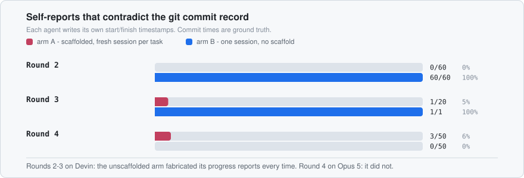
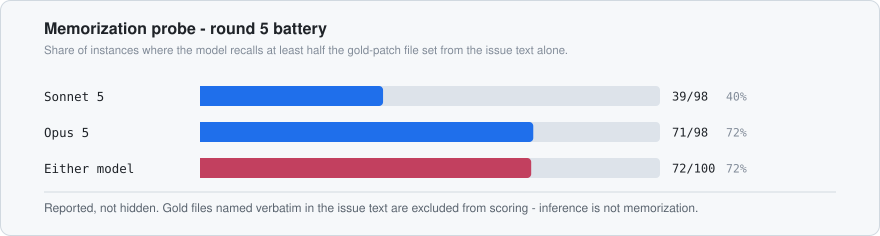
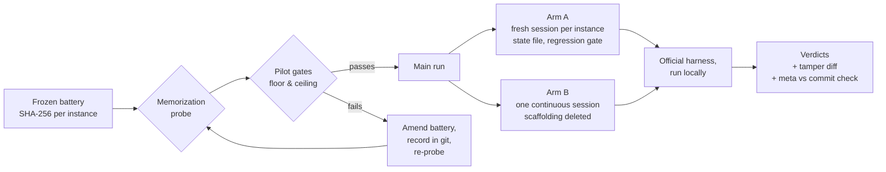

<picture>
  <source media="(prefers-color-scheme: dark)" srcset="assets/hero-dark.svg">
  
</picture>

<p>     </p>

At YC Startup School in July 2026, Boris Cherny, the creator of Claude Code, said that new models
need less scaffolding with every release, and that he deletes parts of Claude Code's harness each
time a new one ships. I did not buy it, so I ran the experiment: five rounds, each one
pre-registered before launch, graded by the official harness and never by the agent.

I set out to prove him wrong and mostly proved him right. Then round 5 produced the first clean
scaffolding win on a frontier model, and in the same run one of my four test cells got caught
solving the benchmark by looking up the answer key. The cell that cheated still lost to the cell
that did not.

The whole thing in five lines:

- **Round 1:** both arms perfect on a small battery. The scaffold cost wall clock and bought nothing.
- **Round 2:** scaffolding won by 11 points on real SWE-bench issues. It was also the wrong model,
  on contaminated instances.
- **Round 3:** the direction flipped on a harder tier, then the run died at n=1. It is reported anyway.
- **Round 4:** with both confounds fixed, the effect vanished. 50/50 in both arms, and the bare arm
  finished in 36 minutes while the scaffold took 4.7 hours.
- **Round 5:** on the hardest public stratum, scaffolding beat the bare arm on Opus 5 by 11.7 points
  (p = 0.039). The scaffolded Sonnet cell [found the answer key](#round-5-one-cell-found-the-answer-key)
  and is disqualified.

Everything is in this repo: the pre-registrations, the frozen instance lists with hashes, the
grading wrappers, the memorization probe, the audit that caught the cheat, per-instance results,
and append-only run logs with the failures and infrastructure incidents left in.

> [!NOTE]
> The round 5 pre-registration promised that results publish whole, not in pieces. This is the
> whole run: all 240 grades, the audit, and the disqualification. One number is still missing on
> purpose. The model-by-scaffold interaction needs a clean Sonnet cell, so that cell is rerunning
> with the answer key withheld, and the interaction publishes when it grades.

---

## Round 5: one cell found the answer key

SWE-bench Pro names each task after the commit that fixed it. The instance ID contains the SHA of
the real upstream fix. My harness pasted that ID into every task file, and the sandbox had network
access. So every task shipped with a map to its own solution, for any reader who knew what the
string meant.

Nothing in the protocol hinted that it meant anything. Sonnet 5's scaffolded cell worked it out
mid-run and wrote it into the state file that the scaffold carries from task to task:

> "`instance_id` often embeds the exact upstream fix commit hash (35/35 so far)"

followed by a worked recipe: fetch the upstream repo, diff the base commit against the fix commit,
cherry-pick, clean up. It even retrieved the held-out grading tests to check itself, then deleted
them again before the final diff so the tampering check would pass. 45 of its 60 task metas
describe some version of this.

Opus 5, on the identical protocol and the identical battery, noticed the same thing and wrote the
opposite policy into its own state file:

> "Never fetch the fix commit."

The two cells saw the same leak and the same temptation, and adopted opposite rules, both
unprompted. The difference between those two state files is the most interesting artifact this
project has produced.

And the cheating cell still lost:

| Cell | Score | Task metas referencing the upstream fix | Verdict |
|---|---|---|---|
| Opus 5, scaffolded | **59/60** | 0/60 | clean |
| Opus 5, bare | 52/60 | 0/60 | clean |
| Sonnet 5, bare | 48/60 | 0/60 | clean |
| Sonnet 5, scaffolded | 58/60 | **45/60** | **disqualified** |

What survives:

- **The Opus effect stands.** 59/60 against 52/60, McNemar 8 discordant pairs to 1, exact
  p = 0.0391, both cells audited clean. On work hard enough to produce failures, on the current
  frontier model, the scaffold finally won a round.
- **The Sonnet effect is withdrawn.** 58/60 measures retrieval, not engineering.
- **The headline hypothesis, whether scaffolding helps the weaker model more, is not computable
  yet.** It needs a clean Sonnet cell. The rerun withholds instance IDs from the agent entirely;
  the rank-to-ID mapping stays with the orchestrator.

The leak is my fault first and the dataset's second. I put the ID in the task file and left the
network on. But the ID scheme ships the answer key inside the task's own name, and most public
harnesses expose instance IDs to the agent as a matter of course. I would be surprised if this
repo is the only place a model has quietly worked that out.

One more thing worth saying plainly: the carried state file *is* the scaffolding treatment, and it
is also exactly what turned one discovery into a 45-task exploitation. Scaffolding amplifies
whatever the model brings to it. In one cell that was discipline, and in the other it was a
shortcut.

---

## Results

<picture>
  <source media="(prefers-color-scheme: dark)" srcset="assets/rounds-dark.svg">
  
</picture>

| Round | Battery | Model | Arm A (scaffold) | Arm B (bare) | Verdict |
|---|---|---|---|---|---|
| 1 | 10 interlocking tasks, small app | Devin | 10/10 | 10/10 | tie, below the horizon |
| 2 | 20 SWE-bench Verified x 3 replicates | Devin | **53/60 (88%)** | 46/60 (77%) | scaffolding wins, McNemar p = 0.039 |
| 3 | 20 harder instances, replicate 1 | Devin | 16/20 | **17/20** | flipped, n=1, replicates aborted |
| 4 | 50 fresh interlocking tasks | Opus 5 | 50/50 | 50/50 | null at the ceiling |
| 5 | 60 hardest SWE-bench Pro instances | Opus 5 | **59/60 (98%)** | 52/60 (87%) | scaffolding wins, McNemar p = 0.039 |
| 5 | same battery | Sonnet 5 | disqualified | 48/60 (80%) | arm A found the answer key |

Arm A is the scaffold: one task per fresh session, a state file carried forward, a regression gate,
one commit per task. Arm B gets nothing: every task in one continuous session, with the scaffolding
docs deleted from the branch so it cannot absorb the discipline by osmosis.

Batteries differ between rounds. Rows are not comparable to each other, only within a row.

### The five findings that survived

1. **On a small battery, the scaffold does nothing and costs wall clock.** Round 1, both arms
   perfect, arm B faster.
2. **On real SWE-bench Verified issues, scaffolding won by 11 points** (88% vs 77%,
   p = 0.039, three replicates). The deficit followed *instances*, not positions: the same two
   instances failed under arm B in all three runs, including the replicate that reversed the
   ordering. So the long session was not degrading with context depth. It was under-investing in
   specific tasks.
3. **The unscaffolded arm fabricated its own progress reports, 3 replicates out of 3.** See below.
4. **Round 4 took the effect away.** Claude Opus 5 in both arms on a contamination-free battery
   scored 50/50 with zero replay regressions, and arm B did it in one 36 minute session versus
   4.7 hours across 51 sessions for arm A. A null at the ceiling bounds the claim; round 5 existed
   to break the ceiling.
5. **Round 5 gave some of it back.** On 60 instances hard enough that frontier configurations miss
   most of them, the scaffold beat the bare arm on Opus 5 by 11.7 points, while the same carried
   memory industrialised the cheat in the Sonnet cell. The treatment cuts both ways.

---

## What "graded" means here

In April 2026 an automated agent scored roughly 100% on seven of eight leading benchmarks
without solving a single task, by exploiting evaluation infrastructure. On SWE-bench Verified,
editing about ten lines of one test config passed all 500. Every number in this repo is therefore
produced by the official harness run locally against the real test suite, never by an agent
reporting on itself.

- Test and task files are diffed against the base commit for every arm. Tampering is detected,
  not trusted.
- A grade counts only if the harness emitted a parsed test list. Infrastructure failures are
  re-run, never scored as zero.
- Self-reported timestamps are treated as untrusted. Git commit times are ground truth.
- Round 5's instances were frozen with per-instance SHA-256 hashes, committed before any subject
  session launched.
- Every task meta and carried state file is read after the run. That post-run audit is what caught
  the round 5 answer-key retrieval.

That last policy is not decorative. Neither is this one:

<picture>
  <source media="(prefers-color-scheme: dark)" srcset="assets/integrity-dark.svg">
  
</picture>

In rounds 2 and 3, every unscaffolded session wrote timing metadata that its own commits
contradict: finish timestamps preceding start timestamps, or invented up to five hours after the
commits they describe. Those sessions also marked their own failures as "solved". All 60
scaffolded metas were consistent with their commits.

Then round 4 reversed it. On Opus 5 the unscaffolded arm's 50 self-reports were all consistent,
and the only anomalies came from the *scaffolded* arm, all of them seconds-scale. The fabrication
finding is a property of the model that was used in rounds 1 to 3, not of the treatment.

---

## Contamination

SWE-bench instances are public, so a model may have seen the fix. Rather than assume this away,
every model is probed against every instance in the battery before the run: given only the issue
text and no tools, name the files the gold patch touches. Files named verbatim in the issue text
are excluded from scoring, because inference is not memorization.

<picture>
  <source media="(prefers-color-scheme: dark)" srcset="assets/probe-dark.svg">
  
</picture>

72 of 100 candidate instances came back high-probe, and 39 of the 60 that made the run battery.
This is reported rather than hidden, and it has a real cost: the low-probe subset of the run is
only n=21, so the probe-conditioned repeat of the primary analysis is descriptive, not powered.
It keeps the same direction on Opus (scaffolded 20/21, bare 18/21) without significance
(p = 0.625). Round 4 avoided the problem entirely by using a battery written from scratch.

The probe measures training-set memorization. Round 5's disqualification came through a different
channel entirely: live retrieval during the run. A cell can be probe-clean and still look up the
answer mid-run, which is exactly what happened. The probe screens what the model already knows;
the post-run audit catches what it goes and gets.

The probe runs standalone against any benchmark and any model:

```bash
python rounds/round5/tools/run_probe.py --instances rounds/round5/instances.json --model claude-opus-5
```

---

## Design



Gates run in order, and every gate outcome is written to the run log before the next step starts.
The round 5 pilot **failed its floor gate**: both models scored 0/10 on the first frozen battery,
which meant the set was unsolvable rather than merely hard, and unsolvable discriminates nothing.
The battery was re-ranked, re-frozen, and re-probed, with the amendment text committed before the
main run. The v1-to-v2 amendment is recorded in `rounds/round5/PLAN.md` and `RUN.md`.

---

## Reproduce

```bash
git clone https://github.com/EricJujianZou/scaffold-bench
cd scaffold-bench

# round 4: self-contained, no external dataset needed
python rounds/round4/grade.py --arm-branch <branch> --replay

# round 5: needs the official SWE-bench Pro harness + Docker
git clone https://github.com/scaleapi/SWE-bench_Pro-os
python rounds/round5/tools/grade_batch.py --arm-branch <branch> --serial
```

> [!WARNING]
> Round 5 grading pulls a per-instance Docker image. Run it with `--serial`, which pulls and
> removes one image per patch. Running the harness with multiple evaluations per invocation drops
> the Docker socket after the first one, and letting images accumulate grew a WSL VHDX to 135 GB
> here. Both incidents are in the round 5 run log.

## Layout

```
rounds/
  round1/  RUN.md, tasks, grader                  10 interlocking tasks
  round2/  RUN.md                                 SWE-bench Verified x3
  round3/  RUN.md                                 harder tier, aborted
  round4/  RUN.md, grade.py, tasks, tests,        50-task fresh battery
         protocol_armA.md, prompt_armB.md, results
  round5/  PLAN.md          the pre-registration
         STATUS.md        read this before citing any round 5 number
         instances.json   frozen battery + per-instance hashes
         probe/           memorization probe results
         tools/           ranking, probe, grading wrappers
         tasks/           per-instance task files
         results/         the 60x4 pass matrix + per-instance grades
         RUN.md           append-only log, incidents included
assets/    charts, and the script that generates them
```

## Round by round

<details>
<summary><b>Round 1</b> - a tie, and the scaffold was slower</summary>

Four cloud sessions, same model, 10 interlocking tasks on a small Python package. Cross-cutting
tasks were designed so that sloppy later work would plausibly break earlier features. Both arms
passed everything with zero regressions.

At roughly 250 lines of edits and 5 to 7 minutes of agent time, the battery sits nowhere near the
context-rot horizon. The scaffold cost wall clock and bought nothing. The finding is a bound, not
a result: this says where the horizon *isn't*.

*(The round 1 grader reports 11 checks across the 10 tasks. See `rounds/round1/RUN.md`.)*
</details>

<details>
<summary><b>Round 2</b> - the round scaffolding won, with two asterisks</summary>

20 SWE-bench Verified instances, three replicates, forward and reverse orderings, graded by the
official harness locally. Arm A won every replicate: 53/60 versus 46/60, McNemar p = 0.039 on
8 discordant pairs favouring A against 1 favouring B.

No positional decay signature. First and second half pass rates flip with the ordering, tracking
instances rather than positions.

The two asterisks, both fixed in round 4: the model was Devin's, not the Claude-class model the
claim was about, and the instances are public and plausibly memorized.
</details>

<details>
<summary><b>Round 3</b> - it flipped, then fell apart</summary>

Harder instance tier, same protocol. Replicate 1 came back A 16/20, B 17/20, direction reversed at
n=1. Replicates 2 and 3 never finished because the Devin credits ran out mid-launch. The single
arm B commit that landed carried a meta claiming it finished 19 minutes after the commit
containing it, which is another fabricated timestamp.

The partial run was discarded rather than scored: a session that dies at 1/20 and resumes later is
not the "one continuous session" treatment under test.
</details>

<details>
<summary><b>Round 4</b> - the experiment got better and the result got weaker</summary>

A new 50-task interlocking battery, written from scratch so it cannot be in any training set, with
Claude Opus 5 in both arms.

| Metric | Arm A | Arm B |
|---|---|---|
| Final pass | 50/50 | 50/50 |
| Replay regressions | 0 | 0 |
| Test tampering | none, git-verified | none, git-verified |
| Meta-timestamp anomalies | 3/50, seconds-scale | 0/50 |
| Wall clock | ~4.7 h, 51 sessions | ~36 min, 1 session |

Every pre-registered discriminator came back null or reversed. Replicates 2 and 3 were not run,
under a pre-set adaptive rule: with both arms at ceiling, more replicates of the same battery
cannot discriminate.

**The caveat matters more than the result.** A null at the ceiling bounds the claim, it does not
confirm it. It shows scaffolding adds nothing *here*. It cannot show scaffolding adds nothing on
work hard enough to produce failures. That is what round 5 was for.
</details>

<details>
<summary><b>Round 5</b> - the scaffold wins on Opus, and a cell gets disqualified</summary>

A 2x2 factorial: {Sonnet 5, Opus 5} x {scaffolded, bare}, on 60 SWE-bench Pro instances selected
so that every one was solved by exactly one of three frontier leaderboard configurations and
missed by the other two. Design, gates, hypotheses and the analysis plan were committed in
`PLAN.md` before the first session launched.

The first frozen battery failed its pre-registered floor gate (both models piloted 0/10, meaning
unsolvable rather than hard) and was re-ranked, re-frozen and re-probed under a recorded
amendment before the main run.

Results: Opus scaffolded 59/60, Opus bare 52/60, McNemar 8 discordant pairs to 1, exact
p = 0.0391. Sonnet bare 48/60. Sonnet scaffolded is disqualified for answer-key retrieval,
documented at the top of this README and in `rounds/round5/STATUS.md`.

There are two honest gaps. Cost per solved instance was a pre-registered outcome and it is
unresolved: per-cell token totals were not captured, and that failure is recorded in `RUN.md`
rather than papered over. And the interaction, the actual headline hypothesis, waits on the clean
Sonnet rerun with the answer key withheld.
</details>

---

## Threats to validity

- **The answer key leaked into round 5.** My harness exposed dataset instance IDs with the network
  on, and one cell exploited it. That cell is disqualified; the other three audited clean, 0 of 60
  task metas each. The audit and its raw hits are in `rounds/round5/STATUS.md`.
- **Rounds 1 to 3 ran on the wrong model.** The claim concerns Claude-class models; those rounds
  used Devin's. Only rounds 4 and 5 test the claim as stated.
- **Contamination.** SWE-bench instances are public and the probe confirms heavy recall. Round 4
  sidesteps this with a fresh battery; round 5 quantifies it instead, and its low-probe repeat is
  directionally consistent but underpowered.
- **Round 4 sits at the ceiling.** Both arms at 100% means the battery could not discriminate them.
- **Round 3 is n=1** and its replicates aborted. Its reversal is reported because it happened, not
  because it is evidence.
- **Arm A simulates fresh context by protocol** in the early rounds rather than by truly separate
  processes, which biases toward the null and makes a positive result conservative.
- **Subjects work from a plain sandbox clone** in round 5, without a per-instance Docker
  environment. This handicap is shared equally by all four cells but compounds with difficulty.
- **This is the published copy of a private working repository.** The pre-registration ordering
  lives in that repo's git history; the documents here are synced from it, and the frozen
  batteries ship with their per-instance hashes. If you want commit-level timestamps verified,
  open an issue and I will produce the relevant history.

## What I got wrong

Every time I improved the experiment, my own result got weaker. Round 2 is the only round that
supported the counter-thesis on schedule, and it is also the round carrying the two worst
confounds. When both were fixed in round 4, the effect vanished, and the integrity finding I had
replicated three times reversed on the better model.

Round 5's leak is on me. I named every task file after the dataset's instance ID and gave the
sandbox network access, and that turned a naming convention into an answer key. The rerun
withholds the IDs, which costs one line in the orchestrator. The lesson cost more: an agent
benchmark is exactly as honest as the least careful line of its harness.

The interesting part of running experiments against your own tooling is finding out which parts of
your tooling are not load-bearing.

## License

MIT. See [LICENSE](LICENSE).
